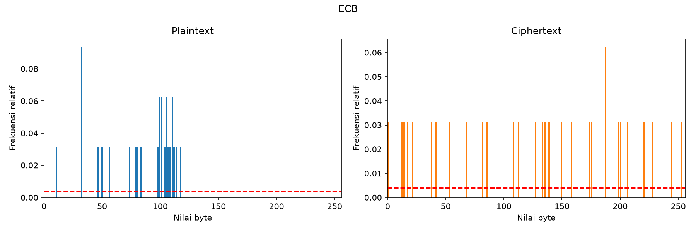
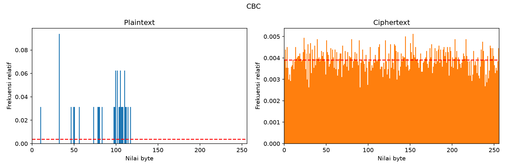
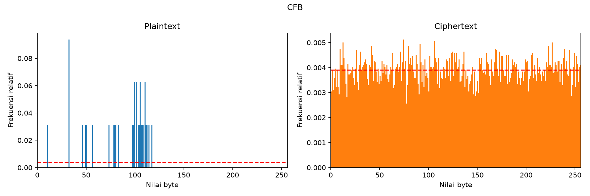
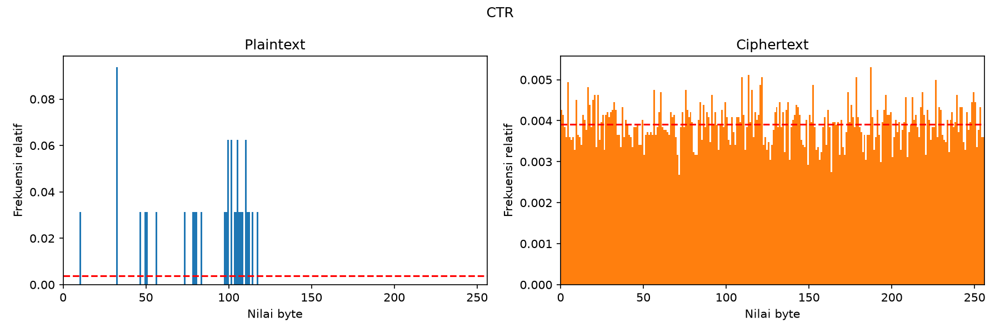

Catatan tambahan
================

Pengujian keamanan
------------------

``uji_keamanan.py`` mengukur avalanche effect dan entropi ciphertext
untuk tiap mode. Dengan kunci ``0123456789abcdef``, IV/counter tetap ``00..0f``, dan
plaintext uji berupa teks berulang sepanjang 16.384 byte:

.. list-table::
   :header-rows: 1
   :widths: 14 28 28 30

   * - Mode
     - AE plaintext
     - AE kunci
     - Entropi ciphertext (maks 8)
   * - ECB
     - 50,66%
     - 50,45%
     - 4,9458
   * - CBC
     - 50,38%
     - 49,27%
     - 7,9890
   * - CFB
     - 25,62%
     - 50,19%
     - 7,9890
   * - OFB
     - 0,78%
     - 49,85%
     - 7,9902
   * - CTR
     - 0,78%
     - 49,68%
     - 7,9895

AE plaintext dihitung dari rata-rata persentase bit ciphertext yang berubah saat 1 bit plaintext
(120 posisi bit) dibalik; AE kunci dari 128 posisi bit kunci. Ideal mendekati 50%.

Pada OFB dan CTR, keystream tidak bergantung pada plaintext, sehingga membalik 1 bit plaintext hanya
membalik 1 bit ciphertext (1/128 ≈ 0,78%). Itu perilaku normal mode aliran. Entropi ECB rendah karena
plaintext uji berulang menghasilkan blok ciphertext berulang, pola yang terlihat pada histogram di bawah.

Histogram frekuensi byte
~~~~~~~~~~~~~~~~~~~~~~~~

Garis merah putus-putus adalah distribusi seragam ideal (1/256).

   ECB

   CBC

   CFB

   OFB

   CTR

Pustaka dan kakas yang dipakai untuk dokumentasi ini
----------------------------------------------------
* `Sphinx <https://www.sphinx-doc.org>`_ dengan domain Python (``py:function``, ``py:module``) untuk menulis referensi API.
* `Furo <https://pradyunsg.me/furo/>`_.
* Hosting statis di `Vercel <https://vercel.com>`_.
